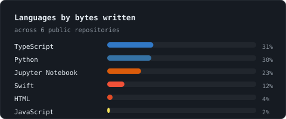

<picture>
  <source media="(prefers-color-scheme: dark)" srcset="assets/banner-dark.svg">
  <source media="(prefers-color-scheme: light)" srcset="assets/banner-light.svg">
  
</picture>

<p align="center">
  
  
  
  
  
  
  
</p>

---

## Some stuff i worked on:

<table>
<tr>
<td width="33%" valign="top">

### 🏛️ [Equity Research Tool](https://github.com/PG-1012/Equity_Research_Tool)

`Python` · `Streamlit` · `PyMuPDF`

Congressional trade disclosures, market data and LLM analysis in one place.

**The problem was the PDFs.** The House Clerk publishes STOCK Act filings with
no ruling lines and a text layer that extracts as `Pʇʔʋʑʆʋʅ`. It's a small-caps
font mapped at a fixed `+0x222` Unicode offset — so it inverts exactly.

```
7,667 transactions
99.5% validated
    0 parse errors
```

Trades plot straight onto the price chart.

</td>
<td width="33%" valign="top">

### ⌨️ [FlowKeys](https://github.com/PG-1012/FlowKeys)

`Swift` · `AppKit` · `CGEventTap`

Copy several things. Paste the one you want. Hold ⌘, tap `V` to walk back
through clipboard history.

**Modelled on ⌘Tab** — a quick tap pastes normally, so ordinary paste is
untouched. Only holding ⌘ reveals the list.

Needed an event tap that can genuinely *consume* a keystroke. A global monitor
can watch ⌘V go past but never stop it.

```
66 tests
 0 new shortcuts
```

</td>
<td width="33%" valign="top">

### 🔬 [Breast Cytology Classifier](https://github.com/PG-1012/Cancer_Prediction_Model_Project)

`Python` · `PyTorch` · `scikit-learn`

Benign vs malignant from nine cytological attributes — and which mistake we're
actually trying to avoid.

**Every model lands near 96%.** The real lever was the decision threshold.
Moving it off the default 0.5:

```
12 → 2 missed
    +3 false alarms
```

The neural net never beat logistic regression. Worth saying out loud.

</td>
</tr>
</table>

---

## How I tend to work

```python
while building:
    assumption = find_the_thing_everyone_took_for_granted()
    if assumption.is_load_bearing():
        measure(assumption)      # not a guess, an actual number
    ship(smallest_thing_that_respects_the_constraint)
```

Three examples of that from the projects above: the "corrupted" PDF text was a
fixed Unicode offset. The clipboard app didn't need a new shortcut, it needed
the one people already press. The cancer model didn't need a better
architecture, it needed a better threshold.

---

<div align="center">
<picture>
  <source media="(prefers-color-scheme: dark)" srcset="assets/stats-dark.svg">
  <source media="(prefers-color-scheme: light)" srcset="assets/stats-light.svg">
  
</picture>
</div>

---

<div align="center">

**Working in fintech in Toronto** 🇨🇦
Currently curious about how much of ML engineering is really just choosing the right thing to care about.

<a href="mailto:rdp.gera@gmail.com">
  
</a>
<a href="https://github.com/PG-1012?tab=repositories">
  
</a>

</div>
